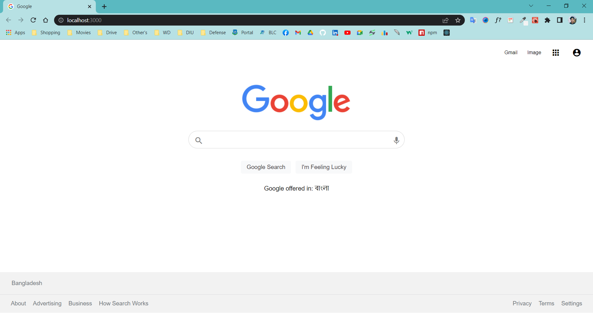

# Project: Google UI Clone

---

- Step 1: create-react-app google-ui-clone
- Step 2: npm start
- Step 3: Clean Up the file
- Step 4: Create Functional Components Like (Header, Footer, Home, Button, Search) and Building then Styling
- Step 5: Separate & Reuse Component
- Step 6: import them in App.js
- Step 7: Destructuring of Props
- Step 8: Deploy Netlify [Live Link](https://googleui-clone.netlify.app/)
- Step 8: Project Push Github

---

<h2 align="left">Connect with me:</h2>

- 👨‍💻 My Portfolio [https://sabbir-portfolio.netlify.app/](https://sabbir-portfolio.netlify.app/)

- 📫 How to reach me **sabbirto13@gmail.com**

<!-- ! My Github Profile Statistics-->
<h2 align="left">My GitHub Stats:</h2>

 
  
  

<h2 align="left">Languages and Tools:</h2>
<h5 align="center">
    
    
    
    
    
    
    
    
    
    
    
    
    
    
    
    
    
    
</h5>