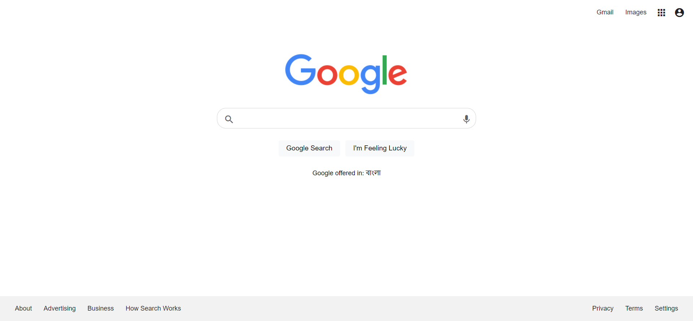

# Project: Google UI Clone
---

---

- Step 1: create-react-app google-ui-clone
- Step 2: npm start
- Step 3: Clean Up the file
- Step 4: Create Functional Components Like (Header, Footer, Home, Button, Search) and Building then Styling
- Step 5: Separate & Reuse Component
- Step 6: import them in App.js
- Step 7: Destructuring of Props, Children as props
- step 8: Conditional render (user is logged in we will show Home page if not logged in will show login page)
- step 9: state(useState)

---